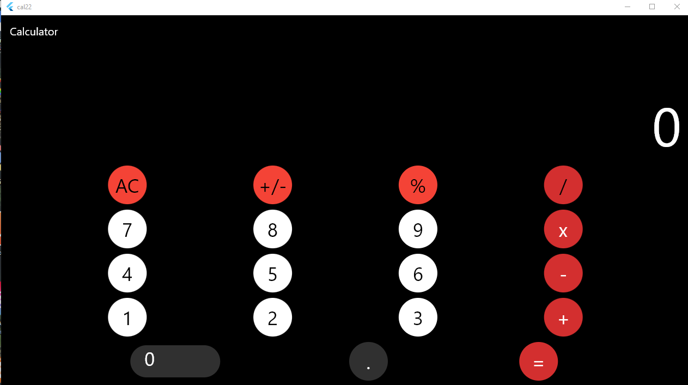
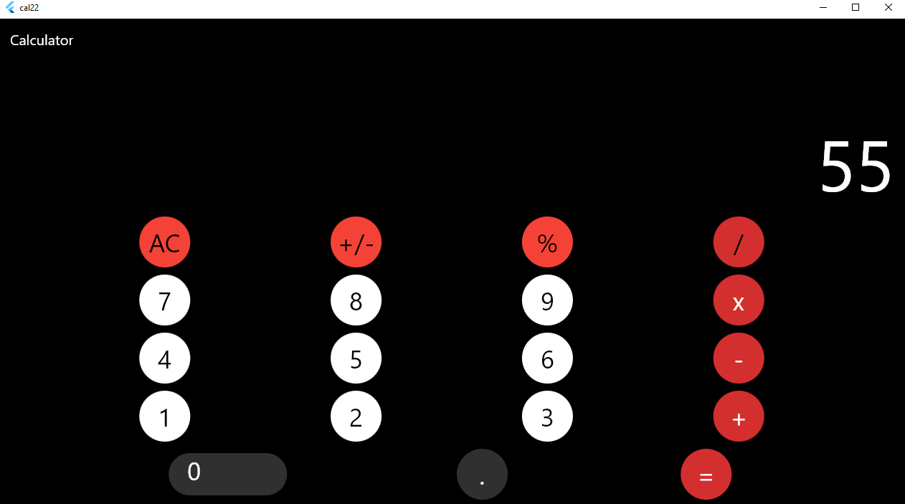
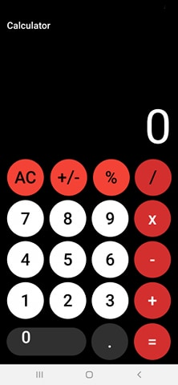

# Desktop Flutter Application

# Calculator

This is the standard Flutter template application, modified to run on desktop.

The `linux` and `windows` directories serve as early prototypes of
what will eventually become the `flutter create` templates for desktop, and will
be evolving over time to better reflect that goal. The `macos` directory has
now become a `flutter create` template, so is largely identical to what that
command creates.

# Image Demo :

